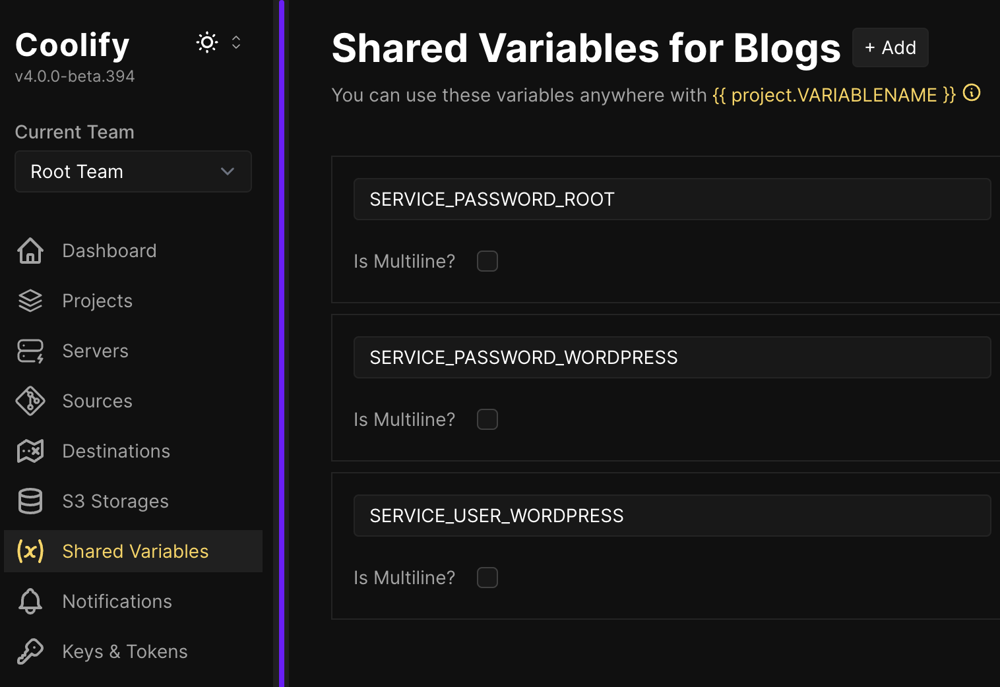
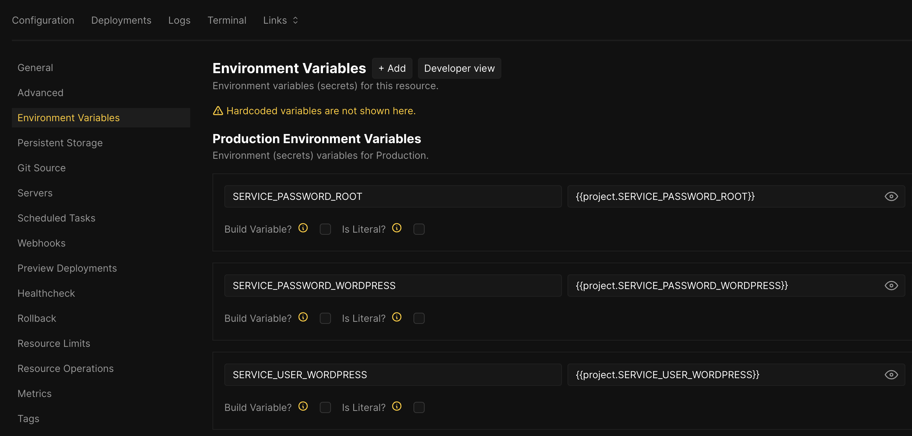

# coolify-wordpress-mariadb-redis

Please go to **Shared variables** => Add the required shared variables.  
For example, add them to **Project wide** and set the corresponding **Value**.  

### shared-variables.png

Next, after adding a resource with **Add Resource**, do not rush to click **Deploy**.  
Go to **Configuration** => **Environment Variables**, and add the corresponding variables to **Production Environment Variables**:
  
For example, 
- `{{project.SERVICE_PASSWORD_ROOT}}`  
- `{{project.SERVICE_PASSWORD_WORDPRESS}}`  
- `{{project.SERVICE_USER_WORDPRESS}}`  

### environment-variables.png

