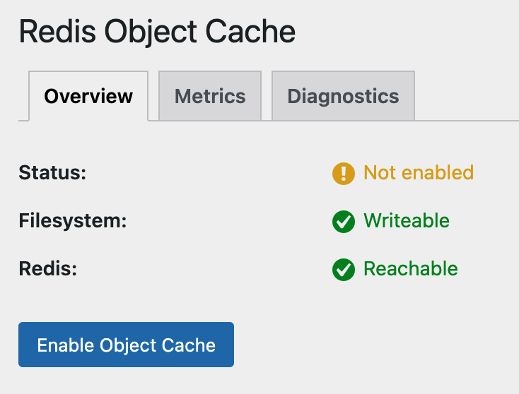

# Simple way:
## [Without PhpRedis](https://wordpress.org/support/topic/do-i-have-to-install-php-redis-and-redis-both-together/)
> Thanks to @Sander in Discord.

Copy the content of `docker-compose-without-phpredis.yaml`, then directly create the resource through `Docker Compose Empty` to deploy and use it.

## With PhpRedis

> Thanks to [@LEstradioto](https://github.com/lestradioto) for the valuable suggestions!

Copy the content of `docker-compose-dockerfile_inline.yaml`, then directly create the resource through `Docker Compose Empty` to deploy and use it.

# Complex way: using docker-compose.yaml
## ***Please fork this project before using it.***

I made adjustments based on this [file](https://github.com/coollabsio/coolify/blob/de299839f4b9ba02df237fa05169909a3815f568/templates/compose/wordpress-with-mariadb.yaml).

## [Environment Variables](https://coolify.io/docs/knowledge-base/environment-variables#shared-variables)

Please go to **Shared variables** => Add the required shared variables.  
For example, add them to **Project wide** and set the corresponding **Value**.  

Next, after adding a resource with **Add Resource**, do not rush to click **Deploy**.  
Go to **Configuration** => **Environment Variables**, and add the corresponding variables to **Production Environment Variables**:
  
For example, 
- `{{project.SERVICE_PASSWORD_ROOT}}`  
- `{{project.SERVICE_PASSWORD_WORDPRESS}}`  
- `{{project.SERVICE_USER_WORDPRESS}}`  

## WordPress Redis Object Cache

